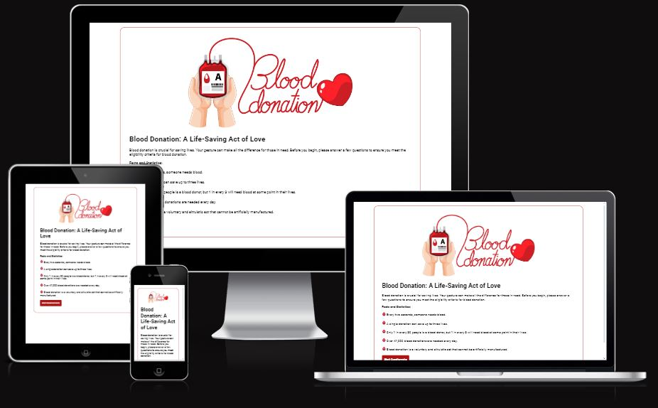
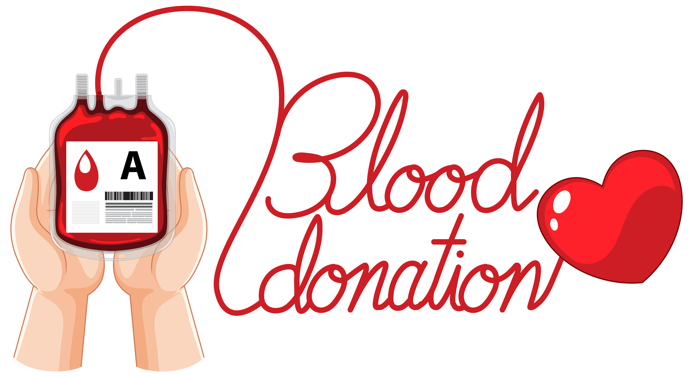

# Blood Donation Questionnaire

Blood Donatiom Questionnaire simplifies the blood donation process with a concise eligibility questionnaire. Tailored in JavaScript, this user-friendly tool empowers potential donors by providing quick insights. Navigate donation criteria effortlessly and contribute confidently to this life-saving mission.

## Features

Built upon robust HTML, CSS, and JavaScript foundations, the Blood Donation Questionnaire employs modern web technologies to deliver an intuitive and responsive user interface. JavaScript functionalities drive the dynamic modal-based questionnaire, enhancing user interaction and providing real-time feedback. This technology synergy underscores the commitment to creating a seamless, informative, and purpose-driven digital space.

### Existing Features

- __Blood Donation Image__

  - An image welcomes visitors, portraying the essence of the platform, a heartwarming depiction of a helping hand reaching out to save lives. This visual metaphor conveys the compassion and collective power of individual contributions, setting the tone for a website dedicated to making a positive impact.

- __Facts and Statistics Area__

  - Embedded within the platform is a dedicated section highlighting critical facts and statistics related to blood donation. These statistics serve as a persuasive element, empowering visitors with knowledge that underscores the urgency and collective impact of blood donation.

- __Modal Design__

  - The modal design concentrates the user's attention on the questionnaire, promoting focused information absorption. Each question is presented in a clear and concise manner, ensuring that users can easily comprehend and respond.

- __Explanation__

  - The Blood Donation Questionnaire integrates concise explanations strategically placed alongside questions. These serve as informative guides, empowering users with the knowledge needed to assess their eligibility for blood donation. This approach fosters transparency, builds trust, and ensures a positive and informed donation experience.

## Testing 

The code undergoes testing to ensure smooth and error-free functionality across various devices and browsers. It successfully passes all tests, guaranteeing a reliable and consistent user experience.

- __Desktop Version__

- __Mobile Version__

### Validator Testing 

- HTML
    - No errors were returned when passing through the official W3C validator
      
      
- CSS
    - No errors were found when passing through the official Jigsaw validator
    - 
      
- Lighthouse
    - Lighthouse score
      
      
- JavaScript
    - No errors were found when passing through the official Jshint validator
      - The following metrics were returned: 
      - There are 6 functions in this file.
      - Function with the largest signature take 2 arguments, while the median is 0.
      - Largest function has 11 statements in it, while the median is 5.5.
      - The most complex function has a cyclomatic complexity value of 3 while the median is 1.

## Deployment & Local Development

### Deployment

I deployed everything my website onto gitpages.

### Local Development

#### How to Clone

1. Log into your account on github
2. Go to the repository of this project Bemajerus/Project-2/
3. Click on the code button, and copy your preferred clone link.
4. Open the terminal in your code editor and change the current working directory to the location you want to use for the cloned directory.
5. Type 'git clone' into the terminal, paste the link you copied in step 3 and press enter.

#### How to Fork

To fork the repository:

1. Log in (or sign up) to Github.
2. Go to the repository for this project, Bemajerus/Project-2/
3. Click the Fork button in the top right corner.

## Technologies Used

**Github** - Used for storage of my site and for publishing online.\
**Visual Studio Code** - The IDE used for editing my site and pushing changes.\
**HTML5** - The core of the site was built with HTML version 5.\
**CSS** - CSS was used to style the website and define fonts and layout.\
**JavaScript** - Implemented for dynamic and interactive features.\
**Google Chrome** - The website was built and tested in google Chrome.

## Credits 

### Content 

- All questions and explanations were taken from the giveblood.ie website.

### Media

- The images used for the page were taken from Google Images.
